# 📱 App-Projeto-Modulo1

Este é um aplicativo mobile desenvolvido com React Native e Expo, criado para gerenciar o estoque, usuários e movimentações de uma farmácia fictícia.

## Funcionalidades

### 1. 🔐 Autenticação
   - Tela de Login com campo de e-mail e senha.
   - Autenticação simples que permite o login de usuários com diferentes perfis, como administrador, motorista e filial.

   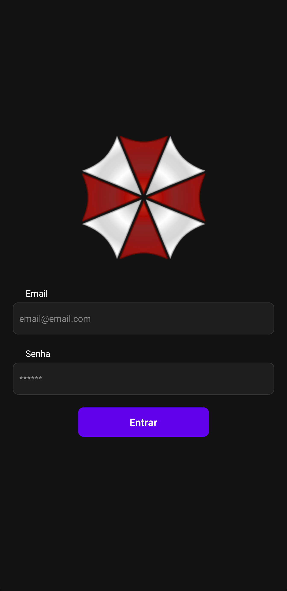

### 2. 🏠 Tela Principal
   - Após o login, o usuário é redirecionado para a tela principal, onde tem acesso às seções de Estoque, Usuários e Movimentações.
   - O layout e as funcionalidades disponíveis variam de acordo com o perfil do usuário.

   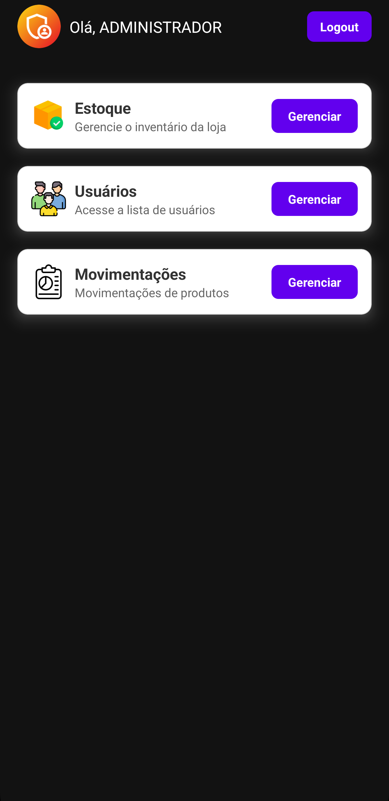

### 3. 📦 Gestão de Estoque
   - Tela de listagem de produtos disponíveis no estoque.
   - Possui um campo de busca 🔍 que permite a filtragem dos produtos por nome.
   - Cada produto exibe informações como quantidade e local de origem.

   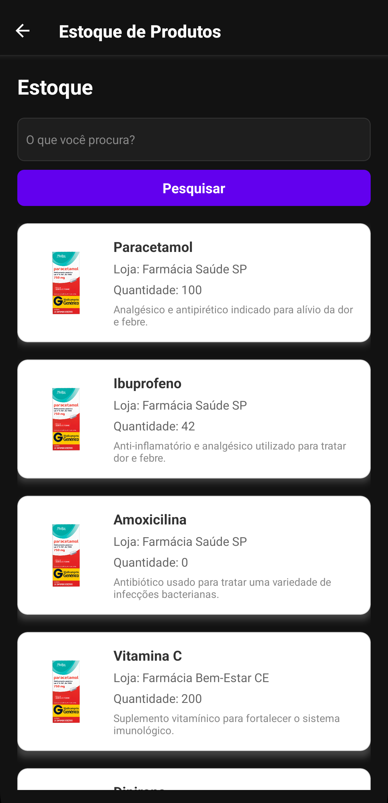

### 4. 👥 Gestão de Usuários
   - Exibe os usuários divididos por perfil (Admins, Motoristas, Filiais).
   - Cada card de usuário exibe o nome, local e tipo de usuário.
   - Os usuários com perfil de administrador podem ativar/desativar usuários e deletar motoristas e filiais.

   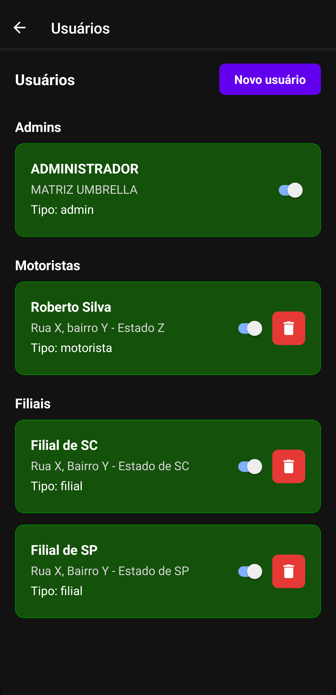
   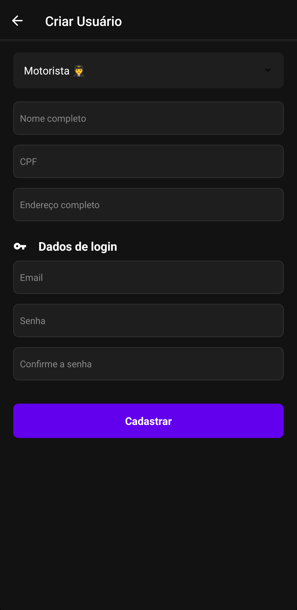

### 5. 🚚 Movimentações
   - Exibe uma lista de movimentações de produtos entre filiais.
   - As movimentações possuem status como created (Pedido Criado), em transito (Em Trânsito) e finalizada (Finalizada).
   - Cada movimentação exibe informações como origem, destino, produto, quantidade, observações e status atual.
   - Usuários com perfil de motorista têm a opção de iniciar e finalizar uma entrega com captura de imagem.

   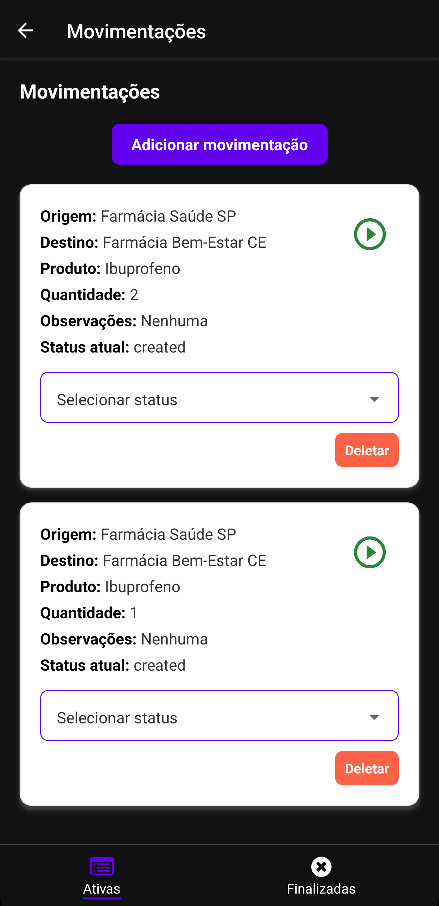
   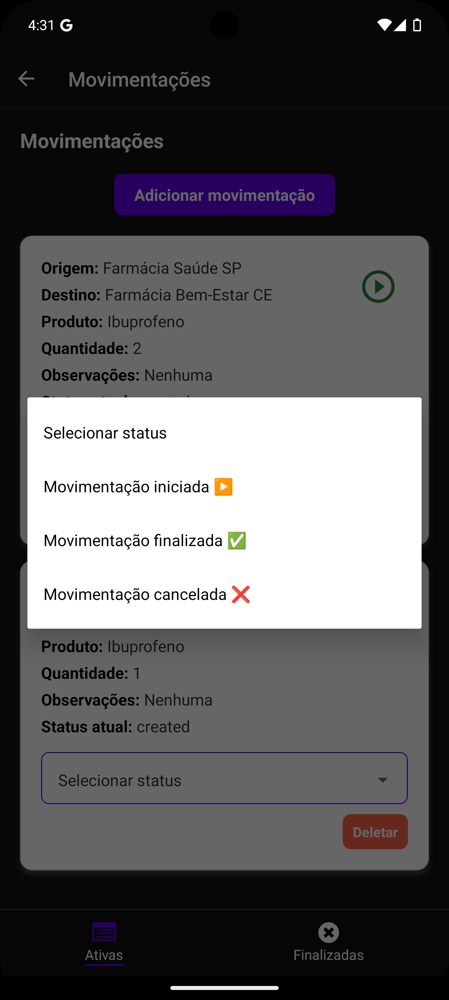
   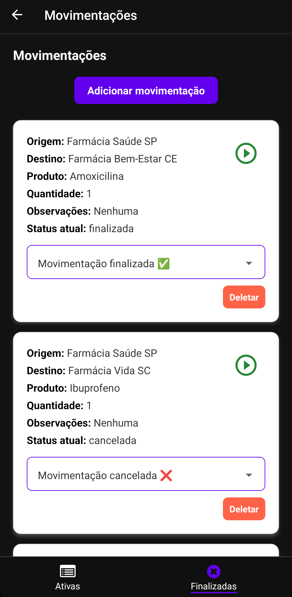

### ➕ Adicionar Movimentação
  - Administradores e Filiais podem adicionar novas movimentações com as seguintes informações:
       - Filial de origem e destino
       - Produto e quantidade
       - Observações adicionais
   - Após adicionar, a movimentação é exibida automaticamente na tela.

   .png)

### 🔄 Atualizar Status da Movimentação
  - Os motoristas podem capturar uma imagem 📸 para atualizar o status para "Em Trânsito" ou "Finalizada".
    Quando o status é atualizado, o card de movimentação muda de cor:
       - Cinza para "Aguardando Coleta"
       - Salmão para "Em Trânsito"
       - Verde Claro para "Finalizada"

   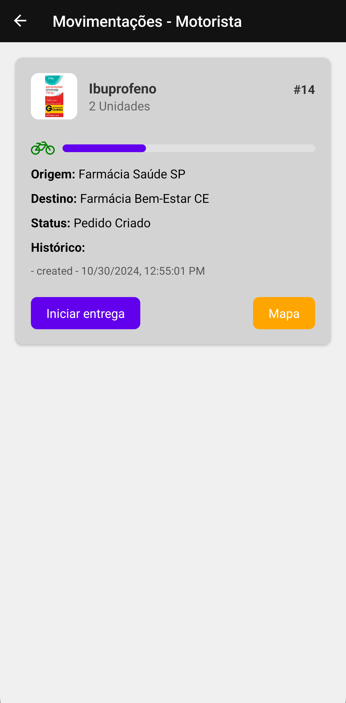
   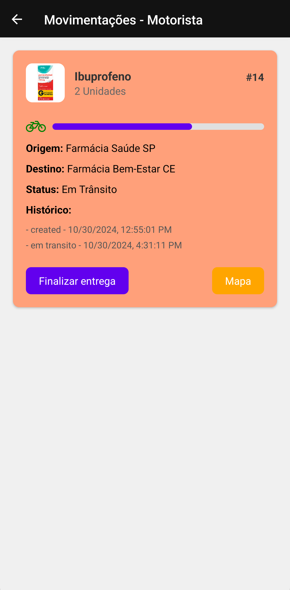
   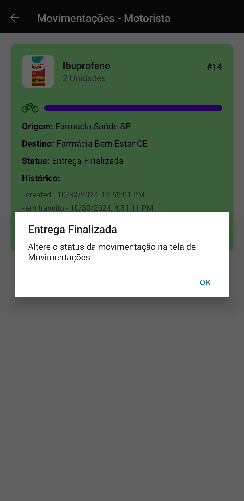

### 🗺️ Ver Mapa
  - Ao iniciar ou finalizar uma entrega, o motorista pode visualizar o trajeto no mapa entre a origem e o destino da movimentação.

  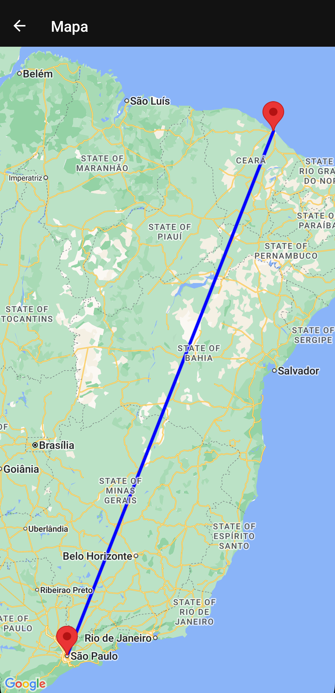

## 🛠 Tecnologias e Bibliotecas Utilizadas

  - React Native - Estrutura de desenvolvimento mobile.
  - Expo - Plataforma para rodar o app em ambiente de desenvolvimento.
  - Axios - Para chamadas HTTP.
  - React Navigation - Para navegação entre telas.
  - AsyncStorage - Armazenamento de dados local.
  - Expo Image Picker - Para captura de imagens durante o processo de movimentação.
  - React Native Maps - Para exibir o trajeto entre pontos no mapa.

## 📂 Estrutura do Projeto

```
src
├── assets                  # Imagens, ícones, fontes, etc.
├── pages                   # Páginas/telas organizadas por categoria
│   ├── Home                # Tela principal do app
│   │   └── Home.jsx        
│   ├── Login               # Tela de autenticação
│   │   └── Login.jsx       
│   ├── Map                 # Tela de mapa
│   │   └── MapScreen.tsx   
│   ├── Movements           # Telas de movimentações
│   │   ├── DriverMovements.jsx
│   │   ├── ListMovements.jsx
│   │   └── RegisterMovements.jsx
│   ├── Products            # Telas de produtos
│   │   └── ListProducts.jsx
│   └── Users               # Telas de gerenciamento de usuários
│       ├── ListUsers.jsx
│       └── RegisterUsers.jsx
├── services                # Configurações de API e chamadas de serviços
│   └── api.js              # Configuração do Axios e endpoints
├── styles                  # Arquivos de estilo globais
│   ├── colors.js           # Paleta de cores
│   └── theme.js            # Estilos globais (ex: tema dark e light)
└── App.js                  # Arquivo principal da aplicação
```

## 📌 Considerações

   Este projeto foi desenvolvido com base nas melhores práticas para React Native e com foco em um design intuitivo.
   Todas as alterações de status e navegação são atualizadas em tempo real para melhorar a experiência do usuário.
